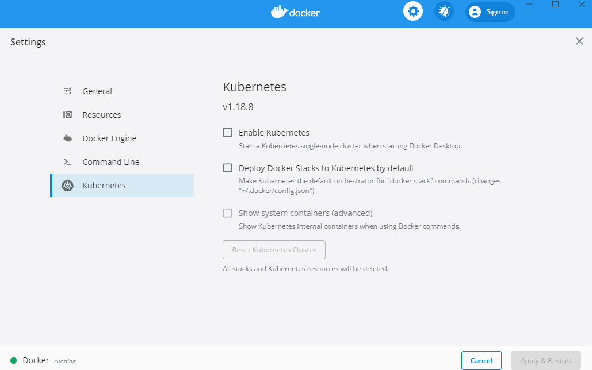
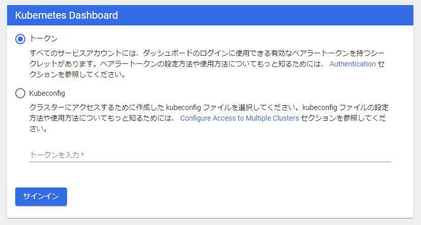
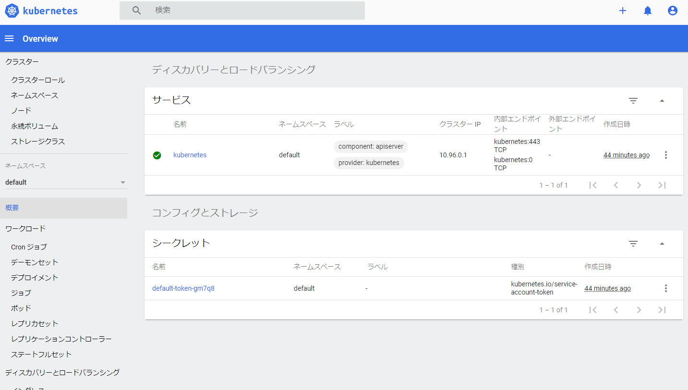

[Docker/Kubernetes 実践コンテナ開発入門：書籍案内｜技術評論社](https://gihyo.jp/book/2018/978-4-297-10033-9)

4章では主にDockerのSwarmモードを使って複数のサービスを同じネットワーク内で連携しあって、TODOアプリを動かしました。

5章ではKubernetes(クーベネティス)を使っていきます。

## 5.Kubernetes入門
* 2017年秋に正式にDockerがKubernetesを統合・サポートすることを発表
* 以降、kubernetesはk8s(ケーエイツ)と記載。

### 5.1 Kubernetesとは
* k8sはGoogle主導で開発された、コンテナの運用を自動化するためのコンテナオーケストレーションシステム
* k8sは様々な部品を組み合わせることで柔軟性の高いアプリケーションを構築できるのが最大の特徴

#### 5.1.1 Dockerの隆盛とKubernetesの誕生
* Dockerが利用され始めた頃、デプロイやコンテナの配置戦略、スケールイン・スケールアウト、サービスディスカバリ、運用のしやすさといった点で課題があった
* その間、様々なオーケストレーションシステムが登場。AWSではECSの登場でコンテナを使ったアプリケーション開発が現実的に
* その中でもここ数年特に存在感を発揮したのが2014年にGoogleがOSSとして公開したk8s
* 様々なプラットフォームでk8sのサポートするサービスが増えた。
  * Googleでは、Google Kubernetes Engine(GKE)
  * Microsoftでは、Azure Kubernetes(AKS)
  * Amazonは、Amazon Elastic Container Service for Kubernetes(ECS)

#### 5.1.2 Kubernetesの位置づけ
* Dockerはコンテナを管理するためのdockerdという常駐プログラムとCLIから成り立つ
* Swarmは複数のホストを束ねてコンテナオーケストレーションを実現。SwarmはDockerの関連技術。
* k8sはSwarmより機能が充実したコンテナオーケストレーション。Docker、rkt、containerdといったコンテナランタイムを扱える。
* Dockerコンテナを管理するという意味でk8s=Swarmとほぼ同じ立ち位置
* k8sはCompose/Stack/Swarmの機能を統合しつつ、より高度に管理できるもの

### 5.2 ローカル環境でKubernetesを実行する
* Docker上でk8sを利用する
* 2018年7月よりDocker for Windows/Macのk8s連携がStable版でも利用できるようになった
* k8s連携はデフォルトでは無効になっているので有効にする必要がある

#### 5.2.1 Docker for Windows/MacでローカルKubenetes環境を構築する
* Windows環境での構築をやっていきます

* Dockerのk8sの設定画面



* k8sの設定
  * 「Enable Kubernetes」にチェック
  * 「Deploy Docker Stacks to Kubernetes by default」にチェック
  * 「Show system containers (advanced)」にチェック
  * Apply & Restart => Install

* kubectlのインストール
  * k8sを操作するためのコマンドラインツール
  * ローカルでもマネージドでも利用する

[kubectlのインストールおよびセットアップ \| Kubernetes](https://kubernetes.io/ja/docs/tasks/tools/install-kubectl/#install-kubectl-on-windows)

1. kubectlをインストール
```
$ curl -LO https://storage.googleapis.com/kubernetes-release/release/v1.10.4/bin/windows/amd64/kubectl.exe
```

2. 環境変数Pathに追加

3. バージョン確認
```
$ kubectl version --client
Client Version: version.Info{Major:"1", Minor:"18", GitVersion:"v1.18.8", GitCommit:"9f2892aab98fe339f3bd70e3c470144299398ace", GitTreeState:"clean", BuildDate:"2020-08-13T16:12:48Z", GoVersion:"go1.13.15", Compiler:"gc", Platform:"windows/amd64"}
```

* ダッシュボードのインストール
  * k8sにデプロイされているコンテナ等を確認できるWebベースの管理ツール

1. ダッシュボードをデプロイ
```
$ kubectl apply -f https://raw.githubusercontent.com/kubernetes/dashboard/v1.8.3/src/deploy/recommended/kubernetes-dashboard.yaml
/src/deploy/recommended/kubernetes-dashboard.yamlcom/kubernetes/dashboard/v1.8.3/
secret/kubernetes-dashboard-certs created
serviceaccount/kubernetes-dashboard created
role.rbac.authorization.k8s.io/kubernetes-dashboard-minimal created
rolebinding.rbac.authorization.k8s.io/kubernetes-dashboard-minimal created
service/kubernetes-dashboard created
error: unable to recognize "https://raw.githubusercontent.com/kubernetes/dashboard/v1.8.3/src/deploy/recommended/kubernetes-dashboard.yaml": no matches for kind "Deployment" in version "apps/v1beta2
```

errorが出ている。

最新はこっちらしい。

[Web UI（ダッシュボード）\| Kubernetes](https://kubernetes.io/docs/tasks/access-application-cluster/web-ui-dashboard/)

```
$ kubectl apply -f https://raw.githubusercontent.com/kubernetes/dashboard/v2.0.0/aio/deploy/recommended.yaml
namespace/kubernetes-dashboard created
serviceaccount/kubernetes-dashboard created
service/kubernetes-dashboard created
secret/kubernetes-dashboard-certs created
secret/kubernetes-dashboard-csrf created
secret/kubernetes-dashboard-key-holder created
configmap/kubernetes-dashboard-settings created
role.rbac.authorization.k8s.io/kubernetes-dashboard created
clusterrole.rbac.authorization.k8s.io/kubernetes-dashboard created
rolebinding.rbac.authorization.k8s.io/kubernetes-dashboard created
clusterrolebinding.rbac.authorization.k8s.io/kubernetes-dashboard created
deployment.apps/kubernetes-dashboard created
service/dashboard-metrics-scraper created
deployment.apps/dashboard-metrics-scraper created
```

2. デプロイ確認
* テキスト通りだと確認できない。
```
$ kubectl get pod --namespace=kube-system -l k8s-app=kubernetes-dashboard
No resources found in kube-system namespace.
```

* 起動している感じはする。
```
$ kubectl get pods --all-namespaces
NAMESPACE              NAME                                         READY   STATUS    RESTARTS   AGE
kube-system            coredns-66bff467f8-hlwqd                     1/1     Running   0          32m
kube-system            coredns-66bff467f8-zjdfl                     1/1     Running   0          32m
kube-system            etcd-docker-desktop                          1/1     Running   0          30m
kube-system            kube-apiserver-docker-desktop                1/1     Running   0          31m
kube-system            kube-controller-manager-docker-desktop       1/1     Running   0          30m
kube-system            kube-proxy-jpglq                             1/1     Running   0          31m
kube-system            kube-scheduler-docker-desktop                1/1     Running   0          31m
kube-system            storage-provisioner                          1/1     Running   0          30m
kube-system            vpnkit-controller                            1/1     Running   0          30m
kubernetes-dashboard   dashboard-metrics-scraper-6b4884c9d5-p7ctj   1/1     Running   0          3m13s
kubernetes-dashboard   kubernetes-dashboard-7b544877d5-rj7zf        1/1     Running   0          3m13s
```

3. ダッシュボードへのプロキシサーバを立ち上げ
```
$  kubectl proxy
Starting to serve on 127.0.0.1:8001
```

以下のURLにアクセス

http://localhost:8001/api/v1/namespaces/kubernetes-dashboard/services/https:kubernetes-dashboard:/proxy/#/login

* k8sのダッシュボード画面



* トークン設定の参考
  * [Windows10 でDocker環境のお勉強メモ \| Docker / Kubernetes 実践コンテナ開発入門（5\.Kubernetes入門） \| Tech Memo](https://tech.shiroshika.com/windows10-docker-kubernetes-5-kubernetes/)

* ログインするためのトークンを作成
* ログインする権限をきめるために権限の一覧を表示
```
$ kubectl -n kube-system get secret
NAME                                             TYPE                                  DATA   AGE
attachdetach-controller-token-xfngd              kubernetes.io/service-account-token   3      39m
bootstrap-signer-token-hnj9t                     kubernetes.io/service-account-token   3      39m
bootstrap-token-abcdef                           bootstrap.kubernetes.io/token         6      39m
certificate-controller-token-2j4hd               kubernetes.io/service-account-token   3      39m
clusterrole-aggregation-controller-token-pc7p7   kubernetes.io/service-account-token   3      39m
coredns-token-6kpjb                              kubernetes.io/service-account-token   3      39m
cronjob-controller-token-2dcmq                   kubernetes.io/service-account-token   3      39m
daemon-set-controller-token-slwfc                kubernetes.io/service-account-token   3      39m
default-token-k4nbg                              kubernetes.io/service-account-token   3      39m
deployment-controller-token-k2vtj                kubernetes.io/service-account-token   3      39m
disruption-controller-token-hghx4                kubernetes.io/service-account-token   3      39m
endpoint-controller-token-bz5wl                  kubernetes.io/service-account-token   3      39m
endpointslice-controller-token-b6rvh             kubernetes.io/service-account-token   3      39m
expand-controller-token-h9fbq                    kubernetes.io/service-account-token   3      39m
generic-garbage-collector-token-5699m            kubernetes.io/service-account-token   3      39m
horizontal-pod-autoscaler-token-4x25f            kubernetes.io/service-account-token   3      39m
job-controller-token-f7rxj                       kubernetes.io/service-account-token   3      39m
kube-proxy-token-69cph                           kubernetes.io/service-account-token   3      39m
kubernetes-dashboard-certs                       Opaque                                0      25m
kubernetes-dashboard-token-d6xpr                 kubernetes.io/service-account-token   3      25m
namespace-controller-token-svt2z                 kubernetes.io/service-account-token   3      39m
node-controller-token-b6hxx                      kubernetes.io/service-account-token   3      39m
persistent-volume-binder-token-hzhcz             kubernetes.io/service-account-token   3      39m
pod-garbage-collector-token-tcjvt                kubernetes.io/service-account-token   3      39m
pv-protection-controller-token-tb5rj             kubernetes.io/service-account-token   3      39m
pvc-protection-controller-token-nlksk            kubernetes.io/service-account-token   3      39m
replicaset-controller-token-p76dh                kubernetes.io/service-account-token   3      39m
replication-controller-token-xvp4j               kubernetes.io/service-account-token   3      39m
resourcequota-controller-token-blqfq             kubernetes.io/service-account-token   3      39m
service-account-controller-token-fvbx8           kubernetes.io/service-account-token   3      39m
service-controller-token-dghwr                   kubernetes.io/service-account-token   3      39m
statefulset-controller-token-nn4dp               kubernetes.io/service-account-token   3      39m
storage-provisioner-token-m9m5b                  kubernetes.io/service-account-token   3      38m
token-cleaner-token-zkx4d                        kubernetes.io/service-account-token   3      39m
ttl-controller-token-4pdjw                       kubernetes.io/service-account-token   3      39m
vpnkit-controller-token-vw2xm                    kubernetes.io/service-account-token   3      38m
```

* 「deployment-controller-token-k2vtj」の権限で入る。
* トークンを作成する
```
$ kubectl -n kube-system describe secret deployment-controller-token-k2vtj
$ kubectl -n kube-system describe secret deployment-controller-token-k2vtj
Name:         deployment-controller-token-k2vtj
Namespace:    kube-system
Labels:       <none>
Annotations:  kubernetes.io/service-account.name: deployment-controller
              kubernetes.io/service-account.uid: 5788d424-2204-4061-9751-7d10cd946406

Type:  kubernetes.io/service-account-token

Data
====
token:      eyJhbGc...(中略)
ca.crt:     1025 bytes
namespace:  11 bytes
```

* トークンを入力してログインできたー！



#### コラム Minikube
* Dockerにk8s連携がくるまではMinikubeがk8s環境構築に利用されていたい。
* Dockerのk8s連携は実行中のdockerdに対してk8s環境を構築
* Minikubeではローカルに新たに別のdockerdを立てk8s環境を構築

## 今日の学び
* k8sの歴史が知れた！ここ最近ではあるけど急速に浸透していっている。この機会に触れてよかった。
* Dockerにはk8s連携があるので、ローカルでk8s環境構築が簡単にできた。
