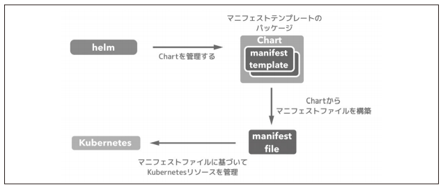

[Docker/Kubernetes 実践コンテナ開発入門：書籍案内｜技術評論社](https://gihyo.jp/book/2018/978-4-297-10033-9)

前回はユーザー管理の途中で力尽きたので、ユーザー管理の続きから。

###	7.2.2 ServiceAccount
* クラスタ内で実行されている実行されているPodからクラスタ内の他のリソースへのアクセスを制御するためのリソース
* kube-systemのnamespaceではk8sのリソースを制御するためのPodがいくつも実行されている
* これらのPodはServiceAccountの働きによって、他のnamespaceで実行されているPodやService、Ingressといったリソース情報の参照や操作ができる
* RBACによって制限することでフェールセーフなアプリケーション構築もできる

* ServiceAccountを作成し、ClusterRoleBindingでRoleとServiceAccountを紐づけ。
* その後Podの定義にてserviceAccountNameでServiceAccountを指定するとそのPodはServiceAccountの権限のみしか操作ができなくなる。

## 7.3 Helm
* HelmはKubernetes chartsを管理するためのツール。 => パッケージ管理ツール
* chartsは設定済みのkubernetesリソースのパッケージ。 => リソースをまとめたパッケージ



* HelmでChartsを管理することで、マニフェストファイルの管理をしやすくすることが大きな目的
* Helmがあれば、複数クラスタへのデプロイを簡潔に管理できる
* HelmはChartsを中心としたk8s開発の総合的な管理ツールとしても使える

### 7.3.1 Helmのセットアップ
* Helmの最新バージョンをインストール
  * [Releases · helm/helm](https://github.com/helm/helm/releases)
* 最終的にはパッケージマネージャでインストールした
```
# 管理者権限でPowerShellを開いて実行
$ choco install kubernetes-helm
# インストールできたことを確認
$ helm help
```
* クラスタに対して初期化処理を行って初めて利用可能になる

* バージョンが違ってhelm initできないようだ。(v3.4.1)
```
$ helm init
Error: unknown command "init" for "helm"

Did you mean this?
        lint

Run 'helm --help' for usage.
```

* v2をダウンロードする
```
$ choco uninstall kubernetes-helm

$ choco install kubernetes-helm --version=2.14.0

$ helm version
Client: &version.Version{SemVer:"v2.14.0", GitCommit:"05811b84a3f93603dd6c2fcfe57944dfa7ab7fd0", GitTreeState:"clean"}
Error: could not find tiller
```

* 初期化
```
$ helm init
Creating C:\Users\snyt45\.helm
Creating C:\Users\snyt45\.helm\repository
Creating C:\Users\snyt45\.helm\repository\cache
Creating C:\Users\snyt45\.helm\repository\local
Creating C:\Users\snyt45\.helm\plugins
Creating C:\Users\snyt45\.helm\starters
Creating C:\Users\snyt45\.helm\cache\archive
Creating C:\Users\snyt45\.helm\repository\repositories.yaml
Adding stable repo with URL: https://kubernetes-charts.storage.googleapis.com
Adding local repo with URL: http://127.0.0.1:8879/charts
$HELM_HOME has been configured at C:\Users\snyt45\.helm.
Error: error installing: the server could not find the requested resource
```

* エラーがでてる。そもそもバージョン確認時にtillerがないと怒られていた。
* 最終的には以下のissue通りにやったら解決した。
  * https://github.com/helm/helm/issues/6473#issuecomment-625964161

* 再度バージョン確認。正しくServerもインストールされた
```
$ helm version
Client: &version.Version{SemVer:"v2.14.0", GitCommit:"05811b84a3f93603dd6c2fcfe57944dfa7ab7fd0", GitTreeState:"clean"}
Server: &version.Version{SemVer:"v2.14.0", GitCommit:"05811b84a3f93603dd6c2fcfe57944dfa7ab7fd0", GitTreeState:"clean"}
```

* Tillerというサーバアプリケーションがkube-systemネームスペースにデプロイされている
* Tillerはhelmコマンドからの指示を受け、インストール等の処理を行う役割
```
$ kubectl -n kube-system get service,deployment,pod --selector app=helm
NAME                    TYPE        CLUSTER-IP     EXTERNAL-IP   PORT(S)     AGE
service/tiller-deploy   ClusterIP   10.55.252.98   <none>        44134/TCP   2m42s

NAME                            READY   UP-TO-DATE   AVAILABLE   AGE
deployment.apps/tiller-deploy   1/1     1            1           2m42s

NAME                                 READY   STATUS    RESTARTS   AGE
pod/tiller-deploy-5d79cb9bfd-5zzg8   1/1     Running   0          2m42s
```

## 今日の学び
* 今日はHelmのセットアップができた。すでにテキストはバージョンが低くv3が出ているようだ。とりあえずはv2でテキスト通りに進められる準備は整った。
