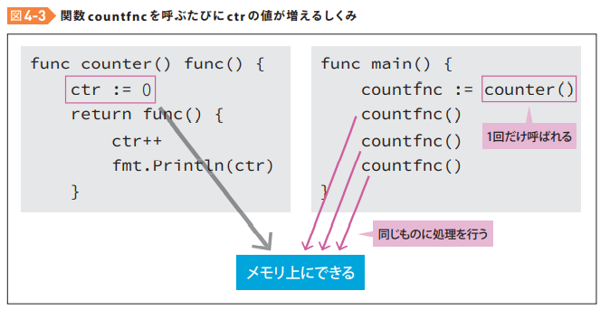

[たった1日で基本が身に付く！ Go言語 超入門：書籍案内｜技術評論社](https://gihyo.jp/book/2020/978-4-297-11617-0)

基本情報もやりつつGoやk8sの学習等もやっていましたが、基本情報はモチベが続かないので捨てます(笑)やっていて正直楽しくないですしね…でも、ネットワーク部分が弱い・気になるということが明確になったので、時間が空いたらネットワークはやろうと思います。

それでは、1日で入門できる本の2日目やっていきます。。

## CHAPTER 4　複雑な処理をまとめる関数
### 関数
* Go言語では、関数も1つのデータ型
* 標準関数
  * Println関数、Printf関数、main関数など

### 関数の定義方法
```
func 関数名(引数 引数のデータ型) 戻り値のデータ型 {
  // 処理
  // return 戻り値
}

// 関数呼び出し
関数名(引数)
```
* 呼び出し時の引数に型は不要
* 呼び出し時に引数がなくても()はいるみたい
* Rubyだとreturnつけなくても戻り値は最後に評価された結果が返るが、Goだとreturnがないとコンパイラに怒られる

### main関数の謎

```
func main() {
  // 処理
}
```
* mainが関数名
* 引数をとらない、戻り値を与えない
* ただただmain関数の中の処理を実行するだけの関数

### 複数の戻り値を与える
* Go言語では、戻り値を複数与えることができる

* 2つの戻り値を与えるscoremaxmin関数
```
func scoremaxmin(scores []int) (max int, min int) {
  max = scores[0]
  min = scores[0]

  for i := 1; i < len(scores); i++ {
    if max < scores[i] {
      max = scores[i]
    }
    if min > scores[i] {
      min = scores[i]
    }
  }

  return
}
```
* 戻り値にも変数名(max, min)を与えて、関数の中でそれらの変数(max, min)に値を与える。
* 関数の最後でreturnとすると、これらの戻り値が与えられることが自動的に決定する
  * Rubyだと複数の戻り値返せないと思ってたけど、Rubyでもできるのか！知らなかった…
  * 今回のように最低値と最高値のように2つの意味を返したいときには便利

* scoremaxmin関数を呼び出し、2つの変数で戻り値を受け取る
```
max, min := scoremaxmin(mathscores)
fmt.Printf("最高点 %d点\n", max)
fmt.Printf("最低点 %d点\n", min)
```

### 「関数の値」ではなく「関数が値」
* どういうこと？
* 前のセクションでは、「関数の値（関数の戻り値）」を利用してきた
* Go言語では、それ以外に関数を以下のような形式で使用できる。
  * 関数自体を「値」として変数に代入する
  * 他の関数の戻り値にする
  * 配列の一要素として集める

```
package main

import "fmt"

func add(a int, b int) (result int, state string) {
	result = a + b
	state = "a + b"
	return
}

func sub(a int, b int) (result int, state string) {
	result = a - b
	state = "a - b"
	return
}

func mul(a int, b int) (result int, state string) {
	result = a * b
	state = "a * b"
	return
}

func div(a int, b int) (result int, state string) {
	result = a / b
	state = "a / b"
	return
}

func main() {
	oprs := []func(int, int) (int, string){
		add, sub, mul, div,
	}

	for i := 0; i < len(oprs); i++ {
		result, state := oprs[i](18, 6)
		fmt.Printf("%s = %d\n", state, result)
	}
}
```
* ここでは関数を4つ定義
  * add関数、sub関数、mul関数、div関数
  * これらの関数の引数と戻り値の数とデータが等しいことに注目
  * func add(int, int) (int, string) => 引数 2、戻り値 2、データ型同じ
  * func sub(int, int) (int, string) => 引数 2、戻り値 2、データ型同じ
  * func mul(int, int) (int, string) => 引数 2、戻り値 2、データ型同じ
  * func div(int, int) (int, string) => 引数 2、戻り値 2、データ型同じ
  * ↓
  * どれも`func(int, int)(int, string)`というデータ型で表せる

* `func(int, int)(int, string)`というデータ型を使って配列を定義する
```
// 配列(スライス)を定義
// 配列の要素の型は先ほどのfunc(int, int) (int, string)を使用
oprs := []func(int, int) (int, string){
  // 要素には関数名だけを書く
  add, sub, mul, div,
}
```

```
for i := 0; i < len(oprs); i++ {
  // i=0のとき、oprs[i](18, 6)はadd(18, 6)と同じ
  // i=1のとき、oprs[i](18, 6)はsub(18, 6)と同じ
  // i=2のとき、oprs[i](18, 6)はmul(18, 6)と同じ
  // i=3のとき、oprs[i](18, 6)はdiv(18, 6)と同じ
  result, state := oprs[i](18, 6)
  fmt.Printf("%s = %d\n", state, result)
}
```

* なるほど、写経するうちになんとなくわかってきた。
  * 関数の引数と戻り値のデータ型の組み合わせ自体がデータ型になる。 => `func(int, int) (int, string)`
  * そのデータ型を指定すれば関数名が配列の1要素になる

### 関数を引数にとる関数
* 関数は値としてみた場合に、データ型を持つので他の引数に取ることも可能

```
// 引数1: fn,     データ型： func(int, int) int
// 引数2: a,      データ型： int
// 引数3: b,      データ型： int
// 引数4: result, データ型： int
func assert(fn func(int, int) int, a int, b int result int) bool {
  // 処理
}
```

### クロージャという特殊な関数
* 関数は「値」なので、戻り値にもできる。
* そこで、関数の中に変数の値を閉じ込める「クロージャ」という技法が実現する

```
package main

import "fmt"

func counter() func() {
	ctr := 0

	return func() {
		ctr++
		fmt.Println(ctr)
	}
}

func main() {
	countfnc := counter()
	countfnc()
	countfnc()
	countfnc()
}
```
* counter関数
  * 引数なし、戻り値に関数を返す

1. `countfnc := counter()`

* 一度だけcounter関数を呼んでいる
  * ctrに0をセット => メモリ上に保存
  * crtをインクリメントする関数を戻して、変数countfncに代入。これでcountfncは関数名
  として使用できる

2. `countfnc()`

* countfncに代入された関数は引数を取らない型なので、()で呼んでいる
* メモリ上に保存されたctrに対して処理を行う

3. `countfnc()`

* 2と同じ

4. `countfnc()`

* 2と同じ

これはテキストの図がわかりやすい。



* 普通だったら関数を呼び出す度にリセットされるような感じだけど、この書き方をするとこのような挙動をするのか・・・
* ctrがずっと同じものが生きているのが不思議な感じ・・・

### クロージャの何がいいのか
* **変数を関数から外に出さない**というのがクロージャの利点

```
func counter(ctr int) int {
  fmt.Println("現カウント数を受け取りました")
  ctr++
  fmt.Println(ctr)
  return ctr // 戻り値として返す必要がある
}

ctr := 0 // 外に変数が必要になる
ctr = counter(ctr) // 戻り値を都度変数に保存しないといけない
ctr = counter(ctr)
ctr = counter(ctr)
fmt.Println(ctr)
```

## 今日の学び
* Go言語では関数も1つのデータ型
   * 関数のデータ型は、`func(int, int) (int, string)`のように`func(引数のデータ型, 引数のデータ型) (戻り値のデータ型, 戻り値のデータ型)`の書ける
* 関数は複数の戻り値を与えられる
* 関数はデータ型を指定すれば、値としても渡せる。値として渡す場合は`関数名`のみ書く
* 関数は引数にとれる
* **クロージャは関数の中に変数を閉じ込める特殊な関数**
